# Objetivo 

Este projeto visa atender todos os requisitos propostos pelo desafio para vaga de Programador PHP

# Executando o sistema
## Make
O processo de levar o sistema usando `make` é simplificado, basta executar os dois comandos a seguir. 
```shell
make install  # Levantar os container com o nginx, php e postgres
make up       # levar os containers
```

## Manual
Caso não tenha o `make` instalado na máquina, rode os comandos a seguir na ordem que aparecem.

```shell
	# Copia .env se não existir
	docker compose exec app cp -n .env.example .env || true

	# Instala dependências PHP
	docker compose exec app composer install --no-interaction --optimize-autoloader

	# Gera chave do app
	docker compose exec app php artisan key:generate

	# Roda migrations e seeds
	docker compose exec app php artisan migrate:reset
	docker compose exec app php artisan migrate --seed --force

	# Instala dependências Node
	docker compose exec app npm ci --prefix /var/www/html

	# Build do Vite para produção
	docker compose exec app npm run build --prefix /var/www/html

	# Ajusta permissões
	docker compose exec app chown -R www-data:www-data storage bootstrap/cache public/build
	docker compose exec app chmod -R 775 storage bootstrap/cache public/build
	
	# levar os containers
	docker compose up -d
```

Após levantar o ambiente, acesse: http://localhost:8080

## requisitos
- docker
- docker-compose
- make (Desejável)

## Arquitetura
Foi utilizado uma arquitetura em camadas aplicando as melhores práticas de desenvolvimento tais como:
- SOLID
- DDD
- Clean Code
- Padrões de projetos

## Tecnologias
- PHP 8.3.6 (cli) (built: Jul 14 2025 18:30:55) (NTS)
- Laravel framework 12.0
- Postgres 16
- Docker version 28.3.3, build 980b856
- GNU Make 4.3
- git version 2.43.0
- PHP 8.3

## Requisitos do teste
* Tecnologia web: Ok (PHP)
* Banco de dados: Ok (Postgres)
* CRUD de Livro: OK
* CRUD de Assunto: OK
* CRUD de Author: Ok
* Seguir modelo de dados: Ok
* Interface usando Bootstrap: OK
* Campos com formação: OK
* Relatório consumindo de view: OK
* O relatório deve trazer as informações das 3 tabelas agrupando os dados por autor: OK
* Relatório exportável para:
  * PDF: OK
  * CSV: OK
* TDD (Test Driven Development): OK
* Tratamento de erros: OK
* As mensagens emitidas pelo sistema: OK
* Incluir um campo de valor (R$): OK
* Guarde todos os scripts e instruções para implantação: OK

## Teste unitários
### Cobertura de 100% do domínio da app
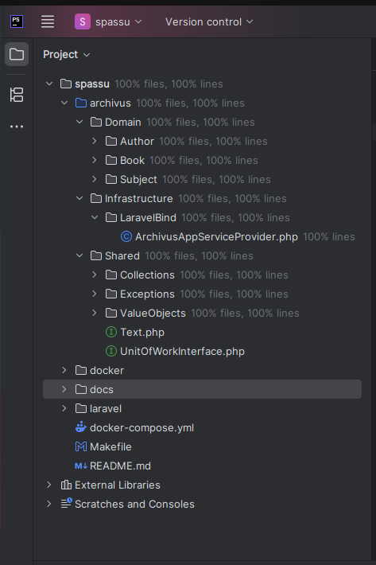.

## Evidências de funcionamento do sistema
### Tela Principal
  - 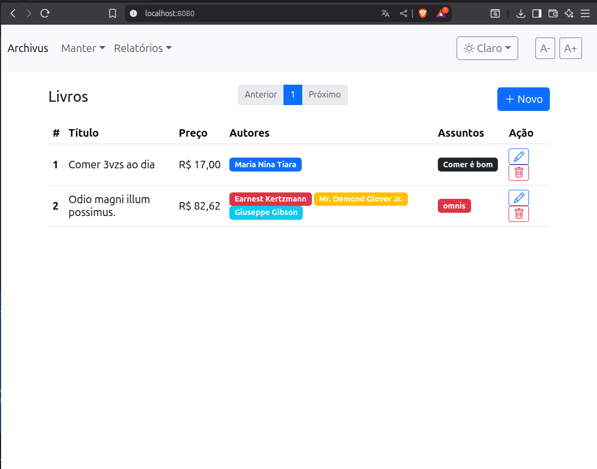

### Livro
  - 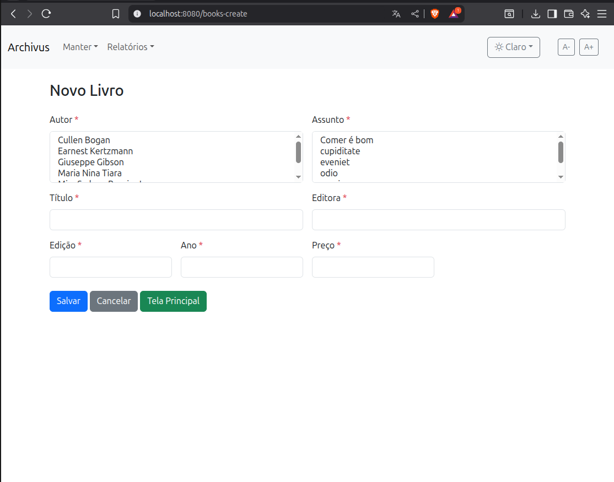
  - 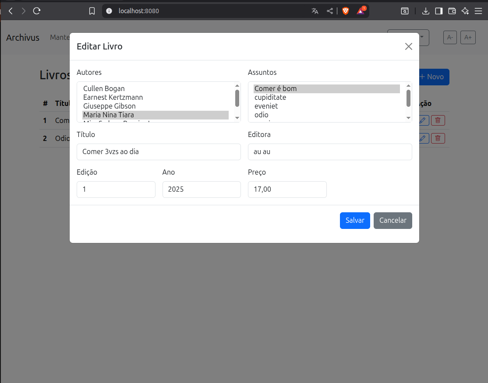
  - 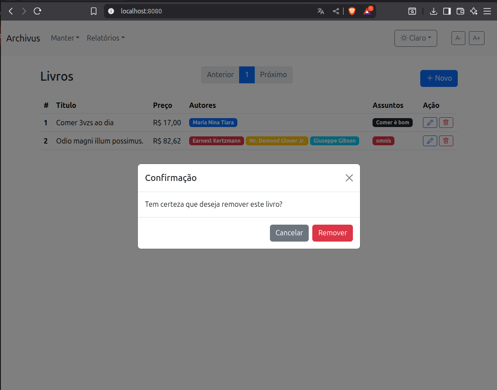

### Autor
- 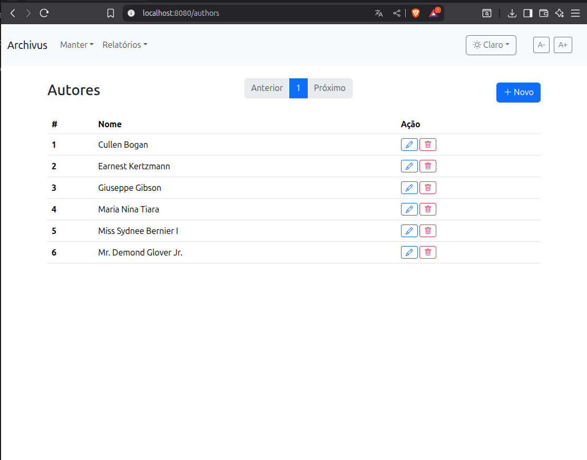
- 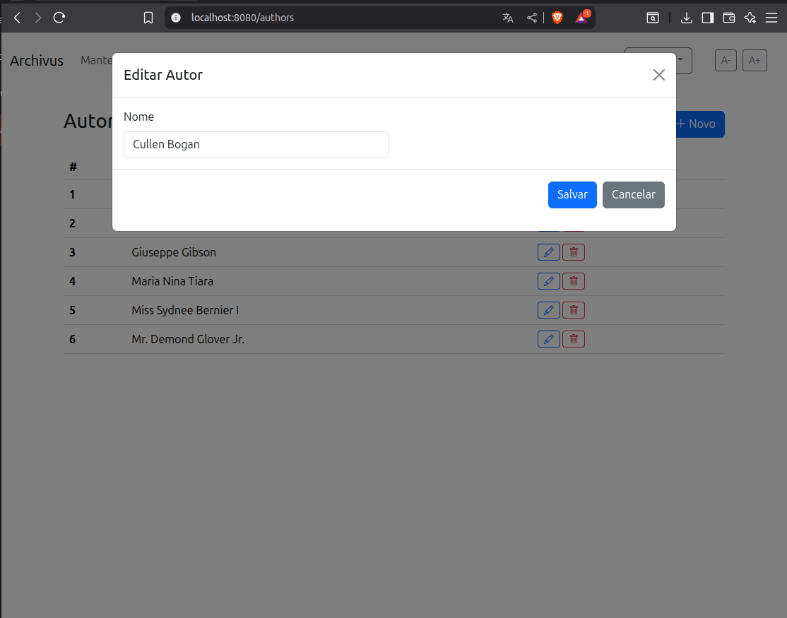
- 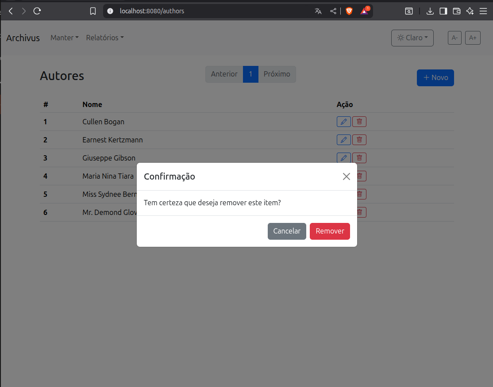

### Assunto
- 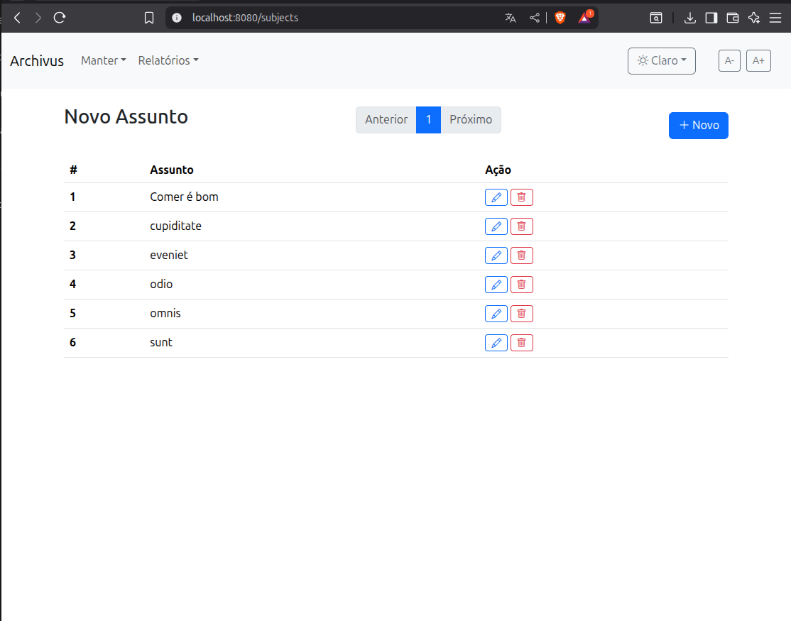
- 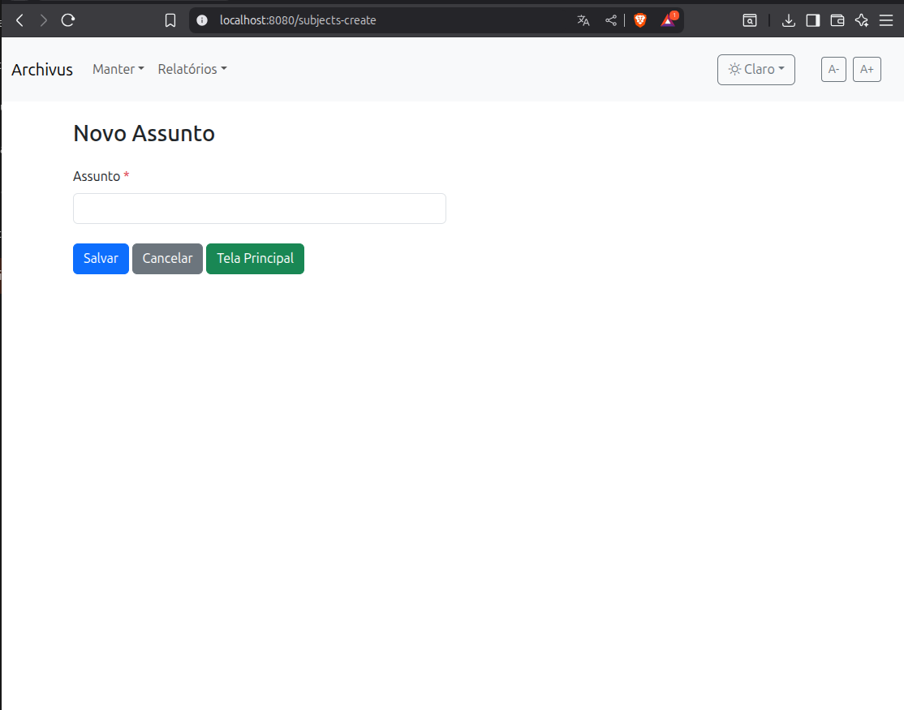
- 
- 

## Relatório
- 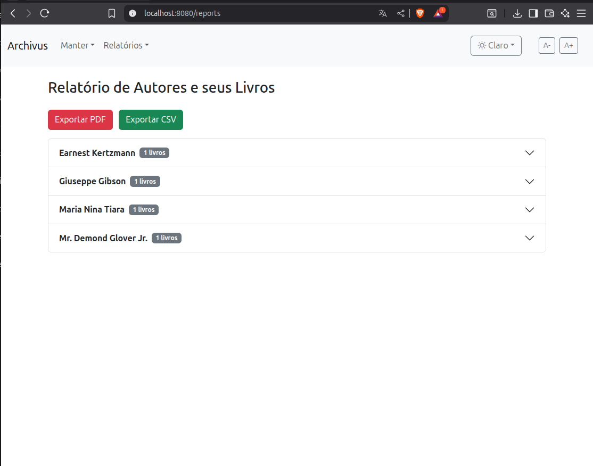
- 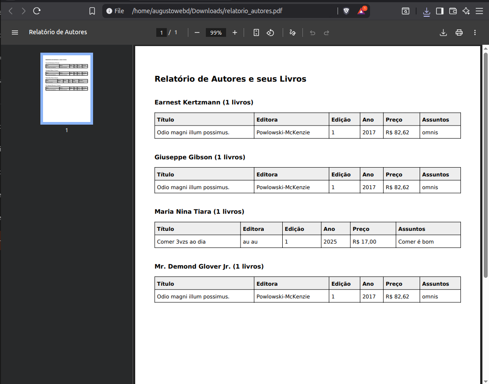
- 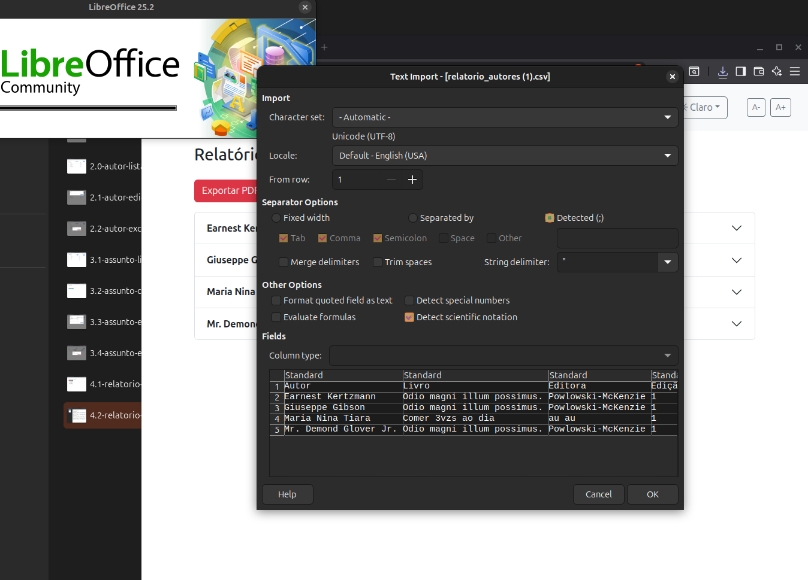
- 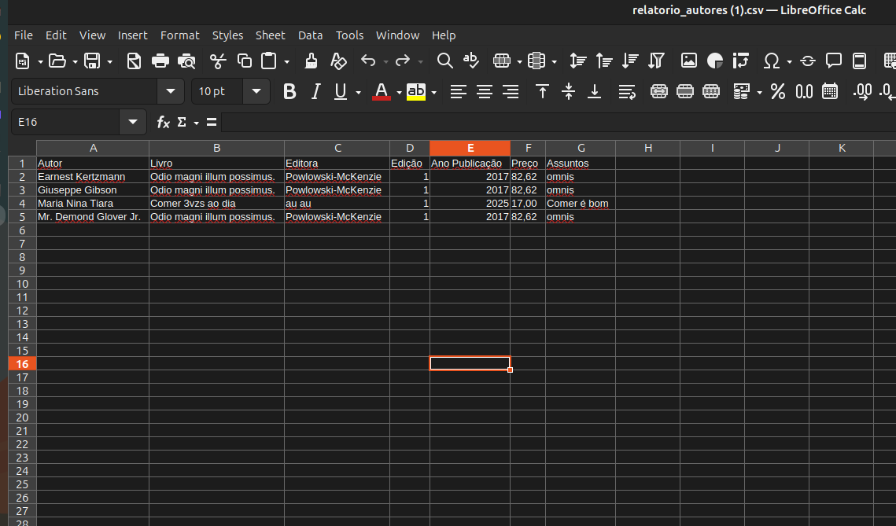
